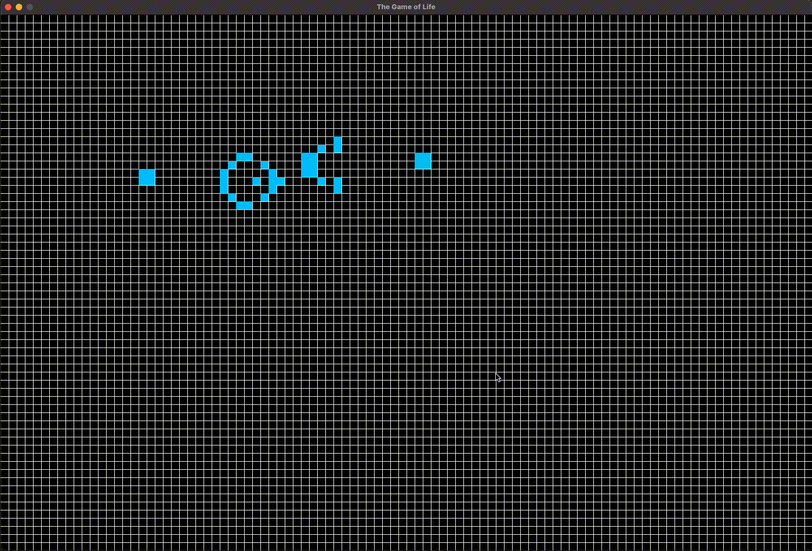

# Game of Life
## _A Pygame Simulation_

This is a Pygame implementation of the famous [Conway's Game of Life](https://en.wikipedia.org/wiki/Conway%27s_Game_of_Life). The game features a set of very simple rules:
1) Any live cell with fewer than two live neighbours dies, as if by underpopulation.
2) Any live cell with two or three live neighbours lives on to the next generation.
3) Any live cell with more than three live neighbours dies, as if by overpopulation.
4) Any dead cell with exactly three live neighbours becomes a live cell, as if by reproduction.

which set the groundwork for the operating system in which the Game's environment takes place. An intial state is set, and every iteration an evolution of the cells takes place based on the above rules. The results are enthralling!  

## How to Run

### Required Software
- Python3
- Pygame

To start the simulation type: 
```sh
python3 GOL.py
```
After running this command, the user will be prompted by the terminal on whether the want to use a preconfigured formation or design their own.
```sh
Would you like to load a formation? (Y/N):
```
If you would like to use a preconfigured formation enter: 
```sh
Y
```
else
```
N
```
If user selects yes, the terminal will then prompt the user to select one of the many preconfigured formations.

Upon selection, the user will be greeted with a grid in which the preconfigured formation will have been loaded into. The usesr can shift the position of the formation using the arrow keys.

Once the user is ready to start the simulation, simply hit the enter key.

If the user instead chooses to create their own custom configuration, the grid will simply load up blank. The user can then click each individual cell to turn it alive.


[](https://www.pygame.org/)